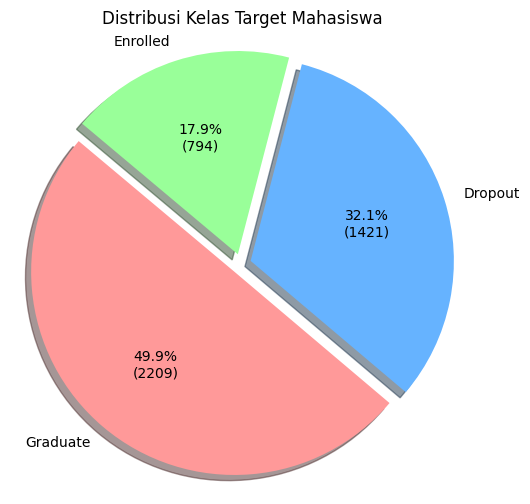
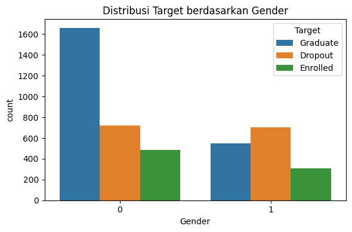

# Laporan Proyek Machine Learning - Ridwan Setiawan (abu_akhdan)

## **1. Domain Proyek**

Proyek ini berfokus pada bidang **pendidikan tinggi**, khususnya analisis risiko putus kuliah (dropout) mahasiswa di awal masa studi. Dengan meningkatnya jumlah mahasiswa yang tidak menyelesaikan studinya tepat waktu atau bahkan keluar sebelum lulus, terdapat kebutuhan mendesak untuk membangun sistem prediktif yang dapat mendeteksi mahasiswa yang berpotensi mengalami masalah akademik sejak dini[1,2,3].

Studi ini menggunakan data yang dikumpulkan dari universitas di Portugal yang mencakup informasi demografis, akademik, serta sosial ekonomi mahasiswa pada saat awal pendaftaran. Tujuan dari proyek ini adalah memprediksi status akhir mahasiswa—dropout, masih aktif (enrolled), atau lulus (graduate)—dengan pendekatan pembelajaran mesin (machine learning).

Sumber data: https://archive.ics.uci.edu/dataset/697/predict+students+dropout+and+academic+success  

Referensi utama: 
- [1] Martins, M. V., Tolledo, D., Machado, J., Baptista, L. M., & Realinho, V. (2021). Early prediction of student’s performance in higher education: A case study. In Trends and Applications in Information Systems and Technologies: Volume 1 9 (pp. 166-175). Springer International Publishing.
- [2] Kok, C. L., Ho, C. K., Chen, L., Koh, Y. Y., & Tian, B. (2024). A Novel Predictive Modeling for Student Attrition Utilizing Machine Learning and Sustainable Big Data Analytics. Applied Sciences, 14(21), 9633.
- [3] Martins, M. V., Baptista, L., Machado, J., & Realinho, V. (2023). Multi-class phased prediction of academic performance and dropout in higher education. Applied Sciences, 13(8), 4702.

___

## **2. Business Understanding**

Putus kuliah di tingkat pendidikan tinggi merupakan isu serius yang berdampak luas, baik secara institusional, personal, maupun sosial. Di banyak negara, termasuk Portugal sebagai lokasi dataset ini, angka dropout yang tinggi menyebabkan kerugian finansial bagi institusi pendidikan, meningkatnya beban ekonomi keluarga, serta rendahnya capaian pendidikan nasional.

Melalui pendekatan data-driven, kita dapat membangun sistem peringatan dini untuk mengidentifikasi mahasiswa yang berisiko tinggi tidak menyelesaikan studi. Deteksi dini ini memungkinkan intervensi personal yang lebih tepat sasaran, seperti bimbingan akademik atau dukungan finansial.

### **2.1. Problem Statements**

1. Bagaimana memprediksi status akhir mahasiswa (dropout, enrolled, graduate) hanya dari data saat pendaftaran?
2. Fitur-fitur mana yang paling memengaruhi kemungkinan seorang mahasiswa mengalami dropout?
3. Seberapa baik model machine learning dapat mengklasifikasikan status akhir mahasiswa dalam skenario multikelas yang tidak seimbang?

### **2.2. Goals**

1. Mengembangkan model prediktif berbasis data awal mahasiswa untuk memetakan kemungkinan status akhir studi.
2. Melakukan analisis korelasi dan eksploratif untuk mengidentifikasi fitur paling signifikan terhadap status kelulusan.
3. Mengevaluasi performa model dalam skenario multikelas dan dataset yang imbalanced, serta melakukan balancing dengan SMOTE-Tomek.

### **2.3. Solution Statements**

Untuk menjawab tujuan di atas, pendekatan berikut diterapkan:

- Melakukan preprocessing dan EDA secara menyeluruh terhadap data pendaftaran mahasiswa.
- Menggunakan teknik balancing data (SMOTE-Tomek) untuk memperbaiki distribusi label yang tidak seimbang.
- Membangun beberapa model klasifikasi (Logistic Regression, SVM, Decision Tree, Random Forest, XGBoost) dan membandingkan performanya berdasarkan metrik klasifikasi multikelas (accuracy, precision, recall, F1-score).
- Menggunakan hyperparameter tuning untuk meningkatkan akurasi model terbaik, serta interpretabilitas melalui visualisasi fitur penting.

___

## **3. Data Understanding**

Dataset yang digunakan dalam proyek ini diperoleh dari repositori UCI Machine Learning yang berjudul [Predict Students' Dropout and Academic Success](https://archive.ics.uci.edu/dataset/697/).dan berisi 4.424 data mahasiswa yang bersumber dari `perguruan tinggi di portugal`. Masing-masing baris mewakili satu mahasiswa dengan total 37 atribut, termasuk informasi demografis, akademik, sosial ekonomi, serta label status akhir mahasiswa (Target).
___

### **3.1. Deskripsi Fitur**

Dataset ini memiliki 36 fitur input dan 1 fitur target. Berikut adalah daftar lengkap fitur:

1. **Marital status:** Status pernikahan mahasiswa
2. **Application mode:** Jalur pendaftaran yang digunakan
3. **Application order:** Urutan pilihan program studi
4. **Course:** Kode program studi yang dipilih
5. **Daytime/evening attendance:** Waktu kehadiran kuliah (siang/malam)
6. **Previous qualification:** Jenis kualifikasi sebelum masuk kuliah
7. **Previous qualification (grade):** Nilai pada kualifikasi sebelumnya
8. **Nacionality:** Kode kewarganegaraan mahasiswa
9. **Mother's qualification:** Tingkat pendidikan ibu
10. **Father's qualification:** Tingkat pendidikan ayah
11. **Mother's occupation:** Jenis pekerjaan ibu
12. **Father's occupation:** Jenis pekerjaan ayah
13. **Admission grade:** Nilai akhir saat diterima di universitas
14. **Displaced:** Status apakah mahasiswa tinggal jauh dari rumah asal
15. **Educational special needs:** Status kebutuhan khusus pendidikan
16. **Debtor:** Status apakah mahasiswa memiliki tunggakan
17. **Tuition fees up to date:** Apakah pembayaran biaya kuliah lancar
18. **Gender:** Jenis kelamin mahasiswa
19. **Scholarship holder:** Status kepemilikan beasiswa
20. **Age at enrollment:** Usia saat pendaftaran
21. **International:** Status internasional mahasiswa
22. **Curricular units 1st sem (credited):** Mata kuliah yang dikonversi semester 1
23. **Curricular units 1st sem (enrolled):** Mata kuliah yang diambil semester 1
24. **Curricular units 1st sem (evaluations):** Evaluasi yang dilakukan semester 1
25. **Curricular units 1st sem (approved):** Mata kuliah yang lulus semester 1
26. **Curricular units 1st sem (grade):** Nilai rata-rata semester 1
27. **Curricular units 1st sem (without evaluations):** Mata kuliah tanpa evaluasi semester 1
28. **Curricular units 2nd sem (credited):** Mata kuliah yang dikonversi semester 2
29. **Curricular units 2nd sem (enrolled):** Mata kuliah yang diambil semester 2
30. **Curricular units 2nd sem (evaluations):** Evaluasi yang dilakukan semester 2
31. **Curricular units 2nd sem (approved):** Mata kuliah yang lulus semester 2
32. **Curricular units 2nd sem (grade):** Nilai rata-rata semester 2
33. **Curricular units 2nd sem (without evaluations):** Mata kuliah tanpa evaluasi semester 2
34. **Unemployment rate:** Tingkat pengangguran saat itu
35. **Inflation rate:** Tingkat inflasi saat itu
36. **GDP:** Produk Domestik Bruto saat itu

Fitur ke-37 adalah:
- **Target:** Kategori status mahasiswa akhir (0 = Dropout, 1 = Enrolled, 2 = Graduate)

Seluruh fitur tidak memiliki missing values, dan sebagian besar merupakan data numerik atau dikodekan sebagai angka kategorik.

___

### **3.2. Distribusi Kelas (Target)**

Berikut merupakan distribusi target (kelas) yang ada pada dataset ditampilkan pada gambar berikut:

berdasarkan gambar di atas maka distribusi label target menunjukkan ketidakseimbangan kelas yang signifikan:

| Label | Jumlah | Persentase |
|-------|--------|------------| 
| Dropout   | 1421   | 32,1% |
| Enrolled  | 794    | 17,9% |
| Graduate  | 2209   | 49,9% |

Distribusi ini memperlihatkan bahwa kelas "Graduate" merupakan mayoritas, sedangkan "Enrolled" merupakan kelas minoritas yang paling sedikit jumlahnya.

___
### 3.3. Statistik Deskriptif

Statistik deskriptif memberikan ringkasan awal terhadap fitur numerik dan kategorikal dalam dataset. Tujuannya untuk:

- Menilai distribusi, rentang, dan potensi outlier.
- Mengidentifikasi fitur yang perlu normalisasi.
- Mendeteksi fitur numerik yang sebenarnya kategorikal berdasarkan variasi nilai unik.

Meskipun banyak fitur direpresentasikan sebagai integer, analisis `nunique()` menunjukkan bahwa sejumlah fitur memiliki jumlah kategori yang terbatas (< 20), sehingga secara fungsional harus dianggap sebagai fitur **kategorikal**. Fitur-fitur tersebut adalah:

- `Marital status` (6 kategori)
- `Application mode` (18 kategori)
- `Application order` (8 kategori)
- `Course` (17 kategori)
- `Daytime/evening attendance\t` (2 kategori)
- `Previous qualification` (17 kategori)
- `Displaced` (2 kategori)
- `Educational special needs` (2 kategori)
- `Debtor` (2 kategori)
- `Tuition fees up to date` (2 kategori)
- `Gender` (2 kategori)
- `Scholarship holder` (2 kategori)
- `International` (2 kategori)
- `Curricular units 1st sem (without evaluations)` (11 kategori)
- `Curricular units 2nd sem (credited)` (19 kategori)
- `Curricular units 2nd sem (without evaluations)` (10 kategori)
- `Unemployment rate` (10 nilai unik)
- `Inflation rate` (9 nilai unik)
- `GDP` (10 nilai unik)
- `Target` (3 kategori)

Fitur-fitur tersebut akan dipertimbangkan sebagai kategorikal saat proses encoding sebelum modeling, meskipun secara teknis bertipe integer.

___
### 3.4. Korelasi Antar Fitur

Analisis korelasi Spearman dengan hasil:

| Fitur | Student Status |
|---|---|
| Student Status | 1.000000 |
| Curricular units 2nd sem (approved) | 0.654049 |
| Curricular units 1st sem (approved) | 0.594194 |
| Curricular units 2nd sem (grade) | 0.559820 |
| Curricular units 1st sem (grade) | 0.497341 |
| Tuition fees up to date | 0.400283 |
| Scholarship holder | 0.301103 |
| Curricular units 2nd sem (enrolled) | 0.241456 |
| Curricular units 1st sem (enrolled) | 0.230576 |
| Admission grade | 0.125791 |
| Displaced | 0.113241 |
| Previous qualification (grade) | 0.112414 |
| Application order | 0.102185 |
| Daytime/evening attendance\t | 0.073066 |
| GDP | 0.053497 |
| Curricular units 2nd sem (credited) | 0.035004 |
| Mother's occupation | 0.032700 |
| Father's occupation | 0.032265 |
| Curricular units 2nd sem (evaluations) | 0.028444 |
| Father's qualification | 0.024058 |
| Curricular units 1st sem (credited) | 0.019971 |
| Unemployment rate | 0.016378 |
| Course | 0.014122 |
| International | 0.002860 |
| Nacionality | 0.002535 |
| Educational special needs | -0.007953 |
| Mother's qualification | -0.018999 |
| Inflation rate | -0.022259 |
| Curricular units 1st sem (evaluations) | -0.027602 |
| Curricular units 1st sem (without evaluations) | -0.081031 |
| Curricular units 2nd sem (without evaluations) | -0.089313 |
| Marital status | -0.103578 |
| Previous qualification | -0.125939 |
| Application mode | -0.214098 |
| Gender | -0.229616 |
| Debtor | -0.239002 |
| Age at enrollment | -0.284946 |

Analisis korelasi Spearman dipilih karena lebih robust terhadap data non-linear dan ordinal. Hasil analisis menunjukkan bahwa fitur-fitur berikut memiliki korelasi signifikan terhadap status akhir mahasiswa:

- Curricular units 2nd sem (approved): 0.62
- Curricular units 2nd sem (grade): 0.56
- Curricular units 1st sem (approved): 0.52
- Curricular units 1st sem (grade): 0.48
- Tuition fees up to date: 0.41
- Scholarship holder: 0.29
- Age at enrollment: -0.24
- Gender: -0.22
- Debtor: -0.24
- Curricular units 2nd sem (enrolled): 0.17
- Admission grade: 0.13

___
### 3.5. Visualisasi Fitur Utama

Visualisasi dilakukan untuk masing-masing fitur yang memiliki korelasi > 0.20 atau < -0.20 terhadap target. Diagram yang digunakan meliputi pie chart, histogram dengan KDE, dan boxplot terhadap target. Visualisasi ini mengungkapkan pola yang berbeda antara mahasiswa yang dropout, masih aktif, atau sudah lulus.

**1. Interpretasi: Tuition fees up to date**

Visualisasi menunjukkan perbedaan yang sangat mencolok antara mahasiswa yang **membayar biaya kuliah secara tepat waktu (1)** dan yang **tidak (0)**.

- Mahasiswa yang membayar tepat waktu (`1`) **dominan lulus (`Graduate`)**, jumlahnya lebih dari dua kali lipat dibandingkan kategori lainnya.
- Sebaliknya, mahasiswa yang tidak membayar tepat waktu (`0`) memiliki jumlah **Dropout** yang signifikan, sementara angka kelulusannya sangat rendah.

**2. Interpretasi: Scholarship holder**

Dari grafik terlihat perbedaan distribusi yang cukup signifikan antara mahasiswa penerima beasiswa (`1`) dan non-penerima (`0`):

- Di antara **non-penerima beasiswa (0)**, jumlah `Dropout` dan `Graduate` relatif tinggi dan seimbang, tetapi tetap menunjukkan bahwa banyak mahasiswa yang **tidak menerima beasiswa cenderung mengalami dropout**.
- Sebaliknya, **penerima beasiswa (1)** didominasi oleh mahasiswa yang berhasil **`Graduate`**, sementara jumlah `Dropout` jauh lebih rendah.

**3.Interpretasi: Debtor**

Fitur `Debtor` mengindikasikan apakah mahasiswa memiliki tunggakan finansial (`1`) atau tidak (`0`). Visualisasi menunjukkan pola yang cukup jelas:

- Sebagian besar mahasiswa **tidak memiliki tunggakan (0)**, dan dalam kelompok ini, **jumlah yang lulus (`Graduate`) sangat tinggi**, diikuti oleh `Dropout` dan `Enrolled`.
- Sebaliknya, di antara mahasiswa yang memiliki tunggakan (`1`), **jumlah `Dropout` jauh lebih tinggi** dibandingkan `Graduate`, yang sangat kecil.

**4.Interpretasi: Gender**

Dalam dataset ini, `Gender` dikodekan sebagai:
- `0 = Perempuan`
- `1 = Laki-laki`

Dari visualisasi:

- **Mahasiswa perempuan (`0`) menunjukkan jumlah kelulusan (`Graduate`) yang sangat tinggi**, jauh melebihi jumlah `Dropout` dan `Enrolled`.
- Sebaliknya, **mahasiswa laki-laki (`1`) memiliki jumlah `Dropout` hampir sama atau bahkan sedikit lebih tinggi dibandingkan `Graduate`**, menunjukkan risiko kegagalan akademik yang lebih besar.

**5.Interpretasi: Age at enrollment**

Histogram ini menunjukkan distribusi frekuensi usia mahasiswa saat pendaftaran ke perguruan tinggi.

- Distribusi jelas **memiliki kemiringan kanan (right-skewed)**.
- Sebagian besar mahasiswa mendaftar pada rentang usia **17 hingga 22 tahun**, yang merupakan usia kuliah tipikal.
- Terlihat adanya **outlier signifikan** hingga usia 60+, yang meskipun jarang, tetap penting untuk analisis dropout.
- Distribusi ini mendukung temuan sebelumnya bahwa **usia yang lebih tua saat pendaftaran memiliki korelasi negatif dengan keberhasilan akademik**, sebagaimana terlihat dalam analisis korelasi dan boxplot terhadap `Target`.

**6. Interpretasi: Curricular units 1st sem (approved)**

Boxplot ini menunjukkan distribusi jumlah mata kuliah yang disetujui/lulus oleh mahasiswa pada semester pertama, berdasarkan status akhir mereka (`Target`).

- **Mahasiswa yang `Graduate` memiliki median jumlah mata kuliah lulus yang paling tinggi** pada semester pertama, dengan persebaran nilai yang cukup konsisten dan banyak outlier di level atas (sangat aktif).
- **Mahasiswa yang `Dropout` cenderung memiliki jumlah mata kuliah lulus yang sangat rendah**, dengan median mendekati nol.
- Kelompok `Enrolled` berada di antara keduanya, namun lebih dekat ke pola `Graduate`.

**7. Interpretasi: Curricular units 1st sem (grade)**

Boxplot ini menggambarkan distribusi nilai rata-rata mahasiswa pada semester pertama, dikelompokkan berdasarkan status akhir (`Target`).

- Mahasiswa yang **`Graduate` menunjukkan nilai rata-rata tertinggi**, dengan median yang konsisten di atas kelompok lain dan distribusi yang relatif rapat.
- Mahasiswa **`Enrolled` juga memiliki distribusi nilai yang stabil**, meskipun sedikit lebih rendah dari kelompok `Graduate`.
- Sebaliknya, kelompok **`Dropout` memiliki sebaran nilai yang sangat lebar**, dengan banyak mahasiswa yang meraih nilai sangat rendah (bahkan nol), meskipun median-nya tampak cukup tinggi secara visual — kemungkinan karena distribusi bimodal atau outlier atas.

**8. Interpretasi: Curricular units 2nd sem (approved)**

Boxplot ini menunjukkan distribusi jumlah mata kuliah yang berhasil diselesaikan (lulus) oleh mahasiswa pada semester kedua berdasarkan status akademik akhir (`Target`).

- Kelompok **`Graduate` menunjukkan jumlah mata kuliah lulus yang paling tinggi**, dengan median mendekati 7–8 mata kuliah.
- Kelompok **`Enrolled` memiliki distribusi yang mirip namun sedikit lebih rendah**, menandakan progres akademik masih berlangsung.
- Sementara itu, kelompok **`Dropout` menunjukkan distribusi nilai yang lebih rendah dan menyebar**, dengan banyak mahasiswa hanya menyelesaikan sedikit atau tidak ada mata kuliah yang lulus pada semester kedua.

**9. Interpretasi: Curricular units 2nd sem (grade)**

Visualisasi ini menunjukkan sebaran nilai rata-rata mahasiswa pada semester kedua berdasarkan status akhir mereka (`Target`).

- Mahasiswa yang **`Graduate` memiliki nilai rata-rata yang tinggi dan konsisten**, dengan median nilai antara 13–14, serta distribusi yang rapat dan simetris.
- Kelompok **`Enrolled` juga menunjukkan nilai yang cukup baik**, meskipun sedikit lebih rendah dibandingkan `Graduate`.
- Sebaliknya, **kelompok `Dropout` memiliki distribusi nilai yang sangat luas**, dari sangat rendah (termasuk nol) hingga tinggi, namun dengan banyak outlier, mengindikasikan ketidakstabilan performa akademik.

**10. Interpretasi: Curricular units 2nd sem (enrolled)**

Boxplot ini memperlihatkan jumlah mata kuliah yang diambil mahasiswa pada semester kedua berdasarkan status akademik akhir (`Target`).

- Mahasiswa **`Graduate` mengambil lebih banyak mata kuliah**, dengan median di atas kelompok `Dropout` dan `Enrolled`, serta distribusi yang lebih lebar dan outlier tinggi (hingga 20+ mata kuliah).
- Kelompok **`Dropout` dan `Enrolled` memiliki jumlah mata kuliah yang diambil cenderung lebih sedikit dan lebih rapat**, dengan median sekitar 5–6.
- Penyebaran yang sempit di kelompok Dropout menunjukkan keterlibatan akademik yang rendah di semester kedua.

**11. Interpretasi: Curricular units 1st sem (enrolled)** 

Visualisasi ini menunjukkan distribusi jumlah mata kuliah yang diambil mahasiswa pada semester pertama, berdasarkan status akhir akademik (`Target`).

- Ketiga kelompok (`Dropout`, `Graduate`, `Enrolled`) memiliki median jumlah matkul yang cukup mirip (sekitar 6), namun:
  - **Mahasiswa `Graduate` cenderung mengambil lebih banyak mata kuliah**, dengan persebaran lebih luas ke arah atas (outlier hingga 25).
  - **Mahasiswa `Dropout` memiliki distribusi yang lebih sempit**, dengan lebih sedikit kasus outlier atas.
- Meskipun perbedaan tidak sejelas fitur `approved` atau `grade`, **jumlah matkul yang diambil tetap mencerminkan inisiatif akademik awal**.

Nilai **korelasi Spearman sekitar +0.16** tidak cukup kuat secara statistik, namun fitur ini tetap memiliki **nilai praktis dalam mendeteksi keterlibatan awal mahasiswa**.

Fitur ini cocok digunakan dalam kombinasi dengan `approved` dan `evaluations` untuk memperkuat pemodelan prediktif berbasis aktivitas akademik awal.

___

## **4. Data Preparation**

### **4.1 Pemrosesan Awal**

Langkah-langkah pemrosesan awal dilakukan untuk menyiapkan dataset agar siap dianalisis dan digunakan dalam model pembelajaran mesin. Berikut tahapan yang dilakukan:

1. **Pengaturan format pembacaan dataset:**
   Dataset berformat `.csv` dengan delimiter `;`, sehingga perlu disesuaikan saat pemanggilan agar data terbaca dengan benar.

2. **Pembersihan dan normalisasi nama kolom:**
   Beberapa nama kolom memiliki karakter tab atau spasi yang tidak konsisten. Oleh karena itu:
   - Semua nama kolom dikonversi ke format bersih dengan mengganti spasi/tab dengan underscore.
   - Seluruh huruf diubah menjadi huruf kecil untuk konsistensi penamaan.

3. **Konversi label target:**
   Fitur target (`Target`) awalnya berupa nilai teks seperti `Dropout`, `Enrolled`, dan `Graduate`.
   - Label ini dikonversi menjadi angka: `0` untuk Dropout, `1` untuk Enrolled, dan `2` untuk Graduate, agar bisa digunakan dalam algoritma klasifikasi.

4. **Pemeriksaan missing values:**
   Dikonfirmasi bahwa tidak ada nilai kosong pada seluruh kolom. Ini sesuai dengan dokumentasi dataset bahwa telah dilakukan preprocessing ketat oleh pemilik data.

5. **Pemeriksaan tipe data:**
   Semua kolom dicek apakah bertipe numerik atau tidak. Sebagian besar fitur kategorik sudah dikodekan dalam bentuk angka (biner atau ordinal), sehingga tidak perlu dilakukan encoding tambahan.
   

### **4.2 Encoding**

Dataset ini telah melalui proses pra-pemrosesan sebelumnya oleh penyusun aslinya, sehingga sebagian besar fitur kategorikal telah dikonversi ke bentuk numerik (misalnya: `Gender`, `Scholarship holder`, `Debtor`).

Namun, target (`Target`) masih berupa string: `Dropout`, `Enrolled`, `Graduate`. Oleh karena itu, pada tahap ini hanya dilakukan encoding terhadap label target menjadi angka:

- Dropout = 0
- Enrolled = 1
- Graduate = 2
  

### **4.3 Pemisahan Fitur dan Target**

Data dibagi menjadi fitur (X) dan target (y), diikuti dengan pemisahan data latih dan data uji dengan proporsi 80:20. Ini dilakukan untuk mengevaluasi model secara adil.

Ukuran data setelah pemisahan:
- X_train: (3539, 11)
- X_test: (885, 11)

Distribusi target pada data latih menunjukkan ketidakseimbangan kelas:
| Label | Kategori  | Jumlah |
|-------|-----------|--------|
| 0     | Dropout   | 1137   |
| 1     | Enrolled  | 635    |
| 2     | Graduate  | 1767   |

### **4.4 Penanganan Data Tidak Seimbang**

Ketidakseimbangan kelas ditangani dengan kombinasi metode SMOTE dan Tomek Links. Pendekatan ini menggabungkan oversampling untuk kelas minoritas dan undersampling untuk menghapus pasangan data yang ambigu antar kelas.

Distribusi target sebelum dan sesudah resampling:

| Label | Kategori  | Sebelum SMOTE-Tomek | Sesudah SMOTE-Tomek |
|-------|-----------|----------------------|----------------------|
| 0     | Dropout   | 1137                 | 1690                 |
| 1     | Enrolled  | 635                  | 1683                 |
| 2     | Graduate  | 1767                 | 1668                 |

Setelah tahap ini, data siap digunakan dalam proses pemodelan.

## 5. Modeling

### 5.1 Pemilihan Model

Masalah prediksi status akhir mahasiswa dikategorikan sebagai klasifikasi multikelas dengan tiga kelas target: Dropout (0), Enrolled (1), dan Graduate (2). Oleh karena itu, digunakan lima algoritma model pembelajaran mesin untuk dibandingkan, yaitu:

- Logistic Regression
- Support Vector Machine (SVM)
- Decision Tree
- Random Forest
- XGBoost

Model dipilih berdasarkan kapabilitas masing-masing:
- LR dan SVM mewakili model linier,
- DT sebagai model interpretable,
- RF dan XGBoost sebagai model ensemble yang kuat terhadap noise dan ketidakseimbangan data.

### 5.2 Pelatihan Model

Semua model dilatih menggunakan data hasil resampling dengan SMOTE-Tomek. Evaluasi dilakukan pada data uji untuk mengukur generalisasi model.

Metrik evaluasi utama:
- Accuracy
- Precision, Recall, F1-score per kelas
- Confusion Matrix untuk visualisasi kesalahan klasifikasi

### 5.3 Hasil Evaluasi Awal Model

Berikut hasil evaluasi awal (sebelum tuning) dari lima model yang digunakan:

| Model              | Accuracy | Macro F1-score | Keterangan                           |
|-------------------|----------|----------------|--------------------------------------|
| Logistic Regression | 72.5%    | 68.7%          | Seimbang, namun belum optimal        |
| SVM               | 71.4%    | 67.9%          | Mirip LR, namun cenderung rigid      |
| Decision Tree     | 67.3%    | 60.4%          | Cenderung overfitting                |
| Random Forest     | 74.8%    | 68.5%          | Performa stabil, basis ensemble      |
| XGBoost           | 74.9%    | 68.6%          | Stabil & menjanjikan untuk dituning  |

Visualisasi classification report & confusion matrix untuk tiap model:

- **[Gambar 1: Classification Report & Confusion Matrix - Logistic Regression]**
- **[Gambar 2: Classification Report & Confusion Matrix - SVM]**
- **[Gambar 3: Classification Report & Confusion Matrix - Decision Tree]**
- **[Gambar 4: Classification Report & Confusion Matrix - Random Forest]**
- **[Gambar 5: Classification Report & Confusion Matrix - XGBoost]**

### 5.4 Hyperparameter Tuning

Dua model terbaik (Random Forest & XGBoost) dipilih untuk dilakukan hyperparameter tuning menggunakan **GridSearchCV** dengan 5-fold cross-validation. Tujuan tuning adalah mengoptimalkan parameter yang paling memengaruhi kinerja model untuk meningkatkan F1-score macro.

#### Hasil Tuning - Random Forest

- Best Parameters:
  - `n_estimators = 200`
  - `max_depth = None`
  - `max_features = 'sqrt'`
  - `min_samples_split = 2`
  - `min_samples_leaf = 1`

- F1 Macro (setelah tuning): **~68%** *(tidak jauh berbeda dengan default)*

- **[Gambar 6: Confusion Matrix & Classification Report - Random Forest Tuned]**

#### Hasil Tuning - XGBoost

- Best Parameters:
  - `n_estimators = 200`
  - `max_depth = 10`
  - `learning_rate = 0.2`
  - `subsample = 0.8`
  - `colsample_bytree = 1.0`

- F1 Macro (setelah tuning): **~67%**

- **[Gambar 7: Confusion Matrix & Classification Report - XGBoost Tuned]**

Perbandingan hasil sebelum dan sesudah tuning disimpulkan bahwa performa tidak meningkat secara signifikan, namun tuning tetap diperlukan untuk mengkonfirmasi stabilitas model dan menghindari overfitting.

## Data Preparation
Pada bagian ini Anda menerapkan dan menyebutkan teknik data preparation yang dilakukan. Teknik yang digunakan pada notebook dan laporan harus berurutan.

**Rubrik/Kriteria Tambahan (Opsional)**: 
- Menjelaskan proses data preparation yang dilakukan
- Menjelaskan alasan mengapa diperlukan tahapan data preparation tersebut.

## Modeling
Tahapan ini membahas mengenai model machine learning yang digunakan untuk menyelesaikan permasalahan. Anda perlu menjelaskan tahapan dan parameter yang digunakan pada proses pemodelan.

**Rubrik/Kriteria Tambahan (Opsional)**: 
- Menjelaskan kelebihan dan kekurangan dari setiap algoritma yang digunakan.
- Jika menggunakan satu algoritma pada solution statement, lakukan proses improvement terhadap model dengan hyperparameter tuning. **Jelaskan proses improvement yang dilakukan**.
- Jika menggunakan dua atau lebih algoritma pada solution statement, maka pilih model terbaik sebagai solusi. **Jelaskan mengapa memilih model tersebut sebagai model terbaik**.

## Evaluation
Pada bagian ini anda perlu menyebutkan metrik evaluasi yang digunakan. Lalu anda perlu menjelaskan hasil proyek berdasarkan metrik evaluasi yang digunakan.

Sebagai contoh, Anda memiih kasus klasifikasi dan menggunakan metrik **akurasi, precision, recall, dan F1 score**. Jelaskan mengenai beberapa hal berikut:
- Penjelasan mengenai metrik yang digunakan
- Menjelaskan hasil proyek berdasarkan metrik evaluasi

Ingatlah, metrik evaluasi yang digunakan harus sesuai dengan konteks data, problem statement, dan solusi yang diinginkan.

**Rubrik/Kriteria Tambahan (Opsional)**: 
- Menjelaskan formula metrik dan bagaimana metrik tersebut bekerja.

**---Ini adalah bagian akhir laporan---**

_Catatan:_
- _Anda dapat menambahkan gambar, kode, atau tabel ke dalam laporan jika diperlukan. Temukan caranya pada contoh dokumen markdown di situs editor [Dillinger](https://dillinger.io/), [Github Guides: Mastering markdown](https://guides.github.com/features/mastering-markdown/), atau sumber lain di internet. Semangat!_
- Jika terdapat penjelasan yang harus menyertakan code snippet, tuliskan dengan sewajarnya. Tidak perlu menuliskan keseluruhan kode project, cukup bagian yang ingin dijelaskan saja.

